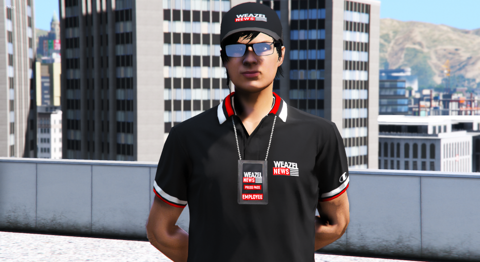
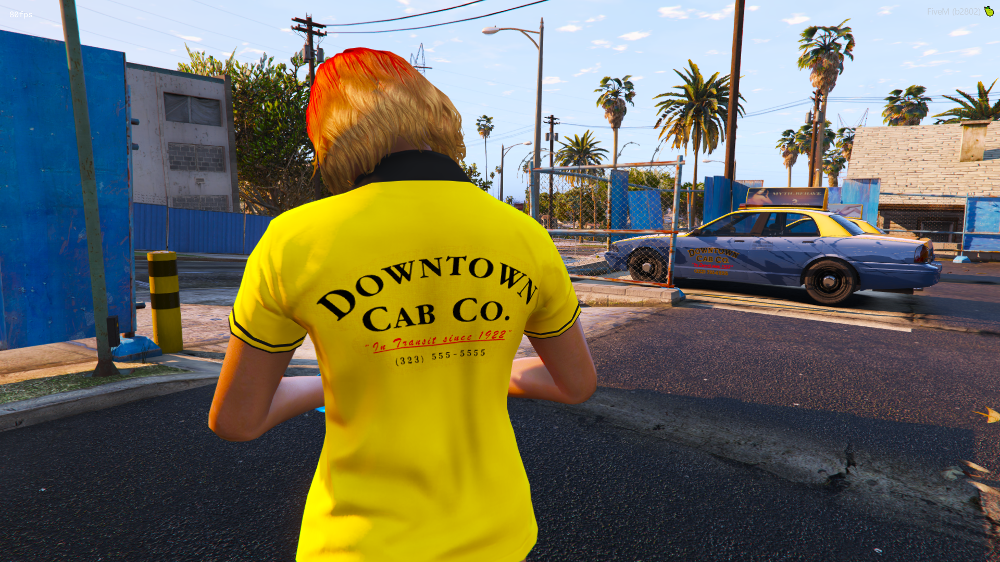

<h1 align="center">👕Tay's Business Pack 👕</h1>

<h2 align="center">Lore friendly uniforms for AltV, FiveM, RageMP &amp; Single Player 👕</h2>

<h2 align="center">DO NOT REUPLOAD WITHOUT MY CONSENT</h2>

<p align="center">
  <a href="https://github.com/TayMcKenzieNZ/TaysBusinessPack"></a>
  <a href="https://github.com/TayMcKenzieNZ/TaysBusinessPack"></a>
  <a href="https://github.com/TayMcKenzieNZ/TaysBusinessPack"></a>
</p>


# To stream this pack on FiveM, you must be a Patron of the $US15 tier or higher, if not, visit the [Patreon page](https://www.patreon.com/fivem). Prices may change at any given date and is out of my control.

*Alternatively, you can set your player count to 10*


----------------------------------

Attention all GTA 5 roleplayers! 

Are you tired of wearing the same old boring clothes? Want to represent your place of business?Well, we've got the solution for you! 

Introducing the Business CPlothing ack for all your virtual fashion needs!

Get ready to turn heads with our high-quality fabrics and stylish designs. Whether you're running errands for your virtual boss or spiking burgers with crack cocaine, you'll be sure to make a statement.

And the best part? It's completely free! That's right, you'd be a fool to pay those exorbitant Tebex prices for virtual clothes when you can get the ultimate clothing pack for your virtual cities at no cost.

With a wide range of designs to choose from, including Burger Shot, Bean Machine, UwU Cafe, Vanilla Unicorn, and more, you'll never run out of options. And don't forget about our exclusive front-facing and backwards-facing cap variants! Perfect for when you need to switch up your style on the fly.

So what are you waiting for? Upgrade your virtual wardrobe today and become the fashion icon you were always meant to be. Remember, virtual fashion is just as important as real-life fashion. Don't miss out on this amazing offer!


---------------------------------------


# Screenshots

| | | |
|-|-|-|
|   |  |   |
|  |  |  |
|   |  |  |
|   |  |  |
|   |  |  |
|   |  |  |
|   |  |  |
|   |  |  |
|   |  |  |
|   |  |  |
|   |  |  |
|   |  |  |
|   |  |  |


**Thanks for downloading and checking out my clothing pack!**


This is a project I slapped together with the help of [DurtyFree's](https://github.com/DurtyFree) [Durty Cloth Tool](https://github.com/DurtyFree/durty-cloth-tool)

---------------------------------------

# Disclaimer ⚠️

This clothing pack was tested on gamebuild mpchristmas3 aka 2802 using the popular script, vMenu, with the understanding that there are *about* 14 additional free .ymt slots to be used on this particular gamebuild.

This pack currently uses 4 YMT's; male, female, and pedalternatevariations which is responsible for things such as hiding or removing hair for hats, making high heels work correctly and making sure that heist bags etc are visible on add-on clothing many other things. In my case, I have used it to squash **default gta online** hairstyles when hoodies are worn up.

Custom hairs lack this option due to the bones missing. Most custom hairs are just static props for your head anyways 🤷‍♂️

 
If for whatever reason you crash using this pack, please read here and perhaps consider downgrading your gamebuild until Rockstar Games increases the [YMT limits](https://tinyurl.com/499ad2zn) on/for future DLCs.


See my FiveM tutorial regarding [gamebuilds:](https://forum.cfx.re/t/tutorial-forcing-gamebuild-to-casino-cayo-perico-tuners-future-dlcs/4784977)

## Clothing Texture Issues:

In case you have issues with clothes appearing black ingame using FiveM, this is a known FiveM issue that should be fixed within the next weeks.

Read this for more details: [FiveM GitHub Issue #1911](https://github.com/citizenfx/fivem/issues/1911)

---------------------------------------

# **FEATURES:** 🌟

## MALE & FEMALE SHIRT 1, MULTIPLE TEXTURE VARIANTS:

```
Burger Shot Employee Red
Burger Shot Manager Black
Bean Machine
UwU Cafe Employee Pink
UwU Cafe Manager Black
Chihuahua Hot Dogs
Taco Bomb
Horny's
Lucky Plucker Employee Red
Lucky Plucker Manager Black
Up N Atom
Pizza This
The Taco Farmer
24 / 7
LTD
Downtown Taxi Co
Smoke On The Water
Yellow Jack Inn
Vanilla Unicorn
Los Santos Customs
Benny's Original Motorwork
Merryweather Security
FLEECA Bank
Gruppe 6 Security
SECURITY

```

---------------------------------------


## MALE & FEMALE SHIRT 2, TUCKED IN VARIANTS #2:

```
Burger Shot Employee Red - Tucked In
Burger Shot Manager Black - Tucked In
Bean Machine - Tucked In
UwU Cafe Employee Pink - Tucked In
UwU Cafe Manager Black - Tucked In
Chihuahua Hot Dogs - Tucked In
Taco Bomb - Tucked In
Horny's - Tucked In
Lucky Plucker Employee Red - Tucked In
Lucky Plucker Manager Black - Tucked In
Up N Atom - Tucked In
Pizza This - Tucked In
The Taco Farmer - Tucked In
24 / 7 - Tucked In
LTD - Tucked In
Downtown Taxi Co - Tucked In
Smoke On The Water - Tucked In
Yellow Jack Inn - Tucked In
Vanilla Unicorn - Tucked In
Los Santos Customs - Tucked In
Benny's Original Motorwork - Tucked In
Merryweather Security - Tucked In
FLEECA Bank - Tucked In
Gruppe 6 Security - Tucked In
SECURITY - Tucked In

```

## WORK SHIRT 2 Male And Female:
```
A - Cluckin Bell
```

---------------------------------------

# Mechanic Overall Shirts
- Los Santos Customs (3 variants)
- Benny's (3 variants)

---------------------------------------


### WORK HAT - Male And Female Front Facing And Backwards Variants:
```
Burger Shot Employee Red
Burger Shot Manager Black
Cluckin Bell
Bean Machine
UwU Cafe Employee Pink
UwU Cafe Manager Black
Chihuahua Hot Dogs
Taco Bomb
Horny's
Lucky Plucker Employee Red
Lucky Plucker Manager Black
Up N Atom
Pizza This
The Taco Farmer
24 / 7
LTD
Los Santos Customs
Benny's Original Motorwork
Merryweather Security
FLEECA Bank
Gruppe 6 Security
SECURITY
```

---------------------------------------


### WORK PANTS - Male And Female Variants:
```
A - Black Work Pants
B - Brown Work Pants
C - Pink UwU Cafe Pants
D - Yellow Cluckin  Bell
```

---------------------------------------

# Mechanic Overall Pants

- Los Santos Customs (3 variants)
- Benny's (3 Variants)

---------------------------------------

# License 📝

This repository was created by TayMcKenzieNZ and is under the GPL V3 license. It was created with the understanding that is open source and free of charge, 
however this does not mean that scumbag South Africans called 'Mavrick' can outright steal and reupload to their Tebex store.

-------------------

# INSTALLATION INSTRUCTIONS:

## Single Player 

- Copy the taysbusinesspack folder found within the FILES > SINGLE PLAYER folder  with the dlc.rpf file to this sub folder of your mods folder: mods/update/x64/dlcpacks (Create it if its not there)

- In order to make the game load this new dlc.rpf file, we need to modify the games dlclist.xml, this can be done by searching for dlclist.xml using OpenIV and copying it to your mods folder: mods/update/update.rpf/common/data (Create it if its not there)

- Open the dlclist.xml and add the following:

```xml
<Item>dlcpacks:/taysbusinesspack/</Item>
```

To apply the new clothes you will need some mod menu, suggested ones are:
Menyoo: [https://github.com/MAFINS/MenyooSP/releases](https://gta5-mods.com/scripts/menyoo-pc-sp)

--------------------------------------

## ALTV

Open the FILES folder, go to ALTV and add taysbusinesspack to your server.cfg as a separate line below resources and before the enclosing. Your server.cfg resources configuration could look similar to this:

```cfg
resources: [
  altv-better-clothing,
  taysbusinesspack
]
```


Start your server and connect to it

--------------------------------------

## FiveM

- Download the updated vMenu and put it in your server/resources folder [vMenu](https://github.com/ProjectFairnessLabs/PF-vMenu/releases)

- Open the FILES folder and drag the taysbusinesspack inside the FIVEM folder, into your FiveM resources

- Add to your server.cfg:
 
```cfg
ensure taysbusinesspack
``` 

- Press M to open vMenu  and browse thru your new added clothes (They are always added to the end / last DLC clothes)

IF THEY DO NOT APPEAR, YOU DO NOT HAVE THE REQUIRED PATREON SUBSCRIPTION TO STREAM CLOTHING.


--------------------------------------

## RageMP

As I have never played RageMP, I do not personally know, however a dump file has been provided. Installation is at your own risk and knowledge.
